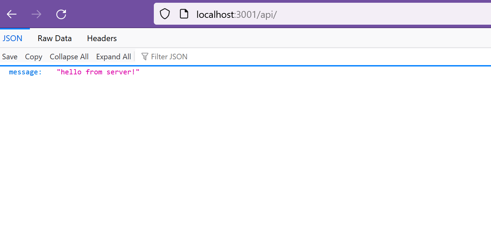
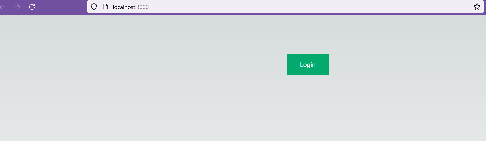
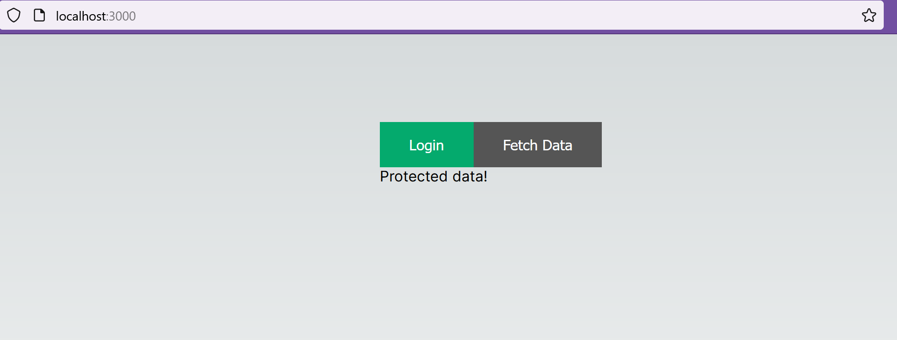

# Securing-API-calls-in-react-apps-with-node.js-as-a-backend-using-static-data
Protecting communication between the front end and back end is one of the most important parts of web application security. This includes safeguarding API endpoints, encrypting data communications, and establishing strong authentication procedures.

npm init

npm install express

touch server.js

code . //

update below code in app.js file to test your server running:
const express = require('express');

const app = express();
const PORT = 3001;

app.listen(PORT, (error) => {
    if(!error) {
        console.log('Server is successfully running & listening on port ', PORT);
    }
    else {
        console.log("Error occurred, server can't read", error);
    }
});

node server.js

// update server.js with below code & run again

app.get('/api', (req,res) => {
    res.json({ message: 'hello from server!' });
})

npm i jsonwebtoken

create a directory for frontend named it for example **frontend**

and clone code from **main** branch to this folder

to run backend server, **node server.js**

to run frontend server, **npm run dev**

